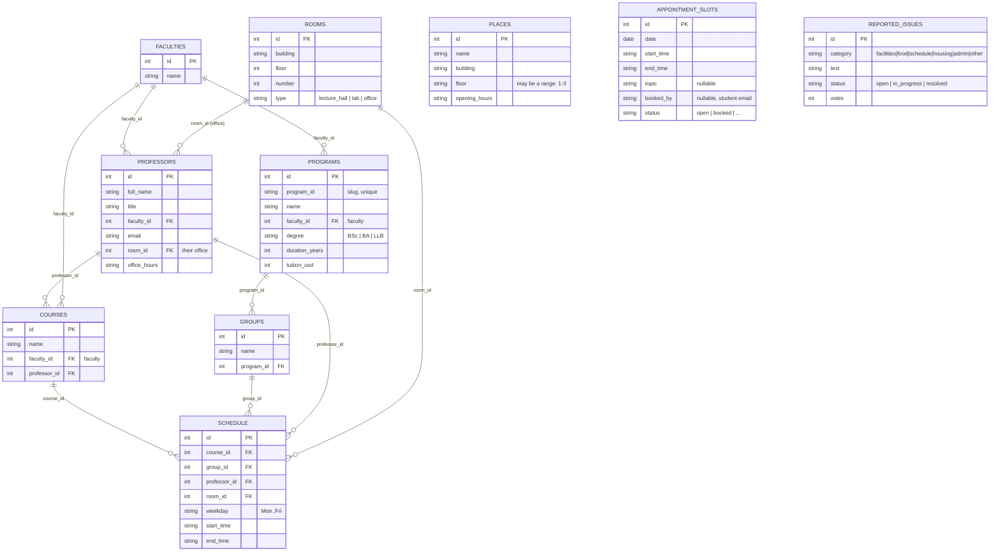

# Relational DB schema (stage 1: seed-data analysis)

This document describes the data in `db/seed/*.json` the way it was designed for a relational database: tables, fields, types and relations. It is the basis for the next stage — designing the DynamoDB model (see `02-dynamodb-model.md`).

Source: 10 JSON files in `db/seed/`.

---

## ER diagram

---

## Tables and fields

### faculties (6 records)
The faculty reference list.

| Field | Type | Key | Description |
|-------|------|-----|-------------|
| id   | int | PK   | Faculty identifier |
| name | string | | Name (unique) |

### programs (15 records)
Study programmes.

| Field | Type | Key | Description |
|-------|------|-----|-------------|
| id | int | PK | Numeric identifier |
| program_id | string | UNIQUE | Slug identifier (`cs-software-engineering`) |
| name | string | | Programme name |
| faculty_id | int | FK → faculties.id | Faculty |
| degree | string | | Degree: BSc / BA / LLB |
| duration_years | int | | Length of study |
| tuition_usd | int | | Tuition, USD |

### groups (10 records)
Student groups.

| Field | Type | Key | Description |
|-------|------|-----|-------------|
| id | int | PK | Group identifier |
| name | string | | Group code (`CS-1`) |
| program_id | int | FK → programs.id | The group's programme |

### professors (10 records)
Teaching staff.

| Field | Type | Key | Description |
|-------|------|-----|-------------|
| id | int | PK | Identifier |
| full_name | string | | Full name |
| title | string | | Title (Professor / Associate Professor) |
| faculty_id | int | FK → faculties.id | Faculty |
| email | string | | Email |
| room_id | int | FK → rooms.id | Their office (a room of type `office`) |
| office_hours | string | | Consultation hours (`Mon 14:00–16:00`) |

### courses (10 records)
Courses / subjects.

| Field | Type | Key | Description |
|-------|------|-----|-------------|
| id | int | PK | Identifier |
| name | string | | Course name |
| faculty_id | int | FK → faculties.id | Faculty |
| professor_id | int | FK → professors.id | The professor who runs it |

### rooms (17 records)
Lecture rooms and offices.

| Field | Type | Key | Description |
|-------|------|-----|-------------|
| id | int | PK | Identifier |
| building | string | | Building |
| floor | int | | Floor |
| number | int | | Room number |
| type | string | | `lecture_hall` / `lab` / `office` |

### schedule (10 records)
The class schedule — a join table (course × group × professor × room).

| Field | Type | Key | Description |
|-------|------|-----|-------------|
| id | int | PK | Class identifier |
| course_id | int | FK → courses.id | Course |
| group_id | int | FK → groups.id | Group |
| professor_id | int | FK → professors.id | Professor |
| room_id | int | FK → rooms.id | Room |
| weekday | string | | Day of the week (Mon..Fri) |
| start_time | string | | Start (HH:MM) |
| end_time | string | | End (HH:MM) |

### places (5 records)
Campus locations (cafeteria, library, gym and so on). A standalone table with no relations.

| Field | Type | Key | Description |
|-------|------|-----|-------------|
| id | int | PK | Identifier |
| name | string | | Place name |
| building | string | | Building |
| floor | string | | Floor (may be a range: `1–3`, `lobby`) |
| opening_hours | string | | Opening hours (free text) |

### appointment_slots (15 records)
Consultation slots (with the admissions office). A standalone table.

| Field | Type | Key | Description |
|-------|------|-----|-------------|
| id | int | PK | Slot identifier |
| date | date | | Date (YYYY-MM-DD) |
| start_time | string | | Start |
| end_time | string | | End |
| topic | string | nullable | Topic (`general`/`programs`/`scholarships`/`housing`/`international`) |
| booked_by | string | nullable | Email of the student who booked the slot |
| status | string | | `open` / `booked` |

### reported_issues (12 records)
Student reports and complaints. A standalone table.

| Field | Type | Key | Description |
|-------|------|-----|-------------|
| id | int | PK | Identifier |
| category | string | | `facilities`/`food`/`schedule`/`housing`/`admin`/`other` |
| text | string | | The text of the report |
| status | string | | `open` / `in_progress` / `resolved` |
| votes | int | | Number of votes |

---

## Relations (foreign keys)

| From | Field | To | Cardinality |
|------|-------|----|-------------|
| professors | faculty_id | faculties.id | many → one |
| programs | faculty_id | faculties.id | many → one |
| courses | faculty_id | faculties.id | many → one |
| professors | room_id | rooms.id | many → one |
| courses | professor_id | professors.id | many → one |
| groups | program_id | programs.id | many → one |
| schedule | course_id | courses.id | many → one |
| schedule | group_id | groups.id | many → one |
| schedule | professor_id | professors.id | many → one |
| schedule | room_id | rooms.id | many → one |

### Standalone tables (no FKs)
- **places** — the campus place reference list.
- **reported_issues** — student reports.
- **appointment_slots** — consultation slots; the `booked_by` field holds the email of the student who booked the slot (there is no separate students table).

---

## Notes for the DynamoDB design stage

The specifics that will shape the key/table design in DynamoDB (in more detail — in `02-dynamodb-model.md`):

1. **Faculty references are unified on `faculty_id`.** Every entity (`professors`, `programs`, `courses`) points at a faculty through `faculty_id` (int, FK → faculties.id). Denormalization by the faculty's string name has been removed — in DynamoDB one stable faculty key is enough.
2. **The programme identifier.** A programme has two fields: `program_id` (a slug, `cs-software-engineering`) and `id` (int); `groups.program_id` points at the numeric `id`. For DynamoDB we take the slug (`program_id`) as the partition key — it is stable and human-readable; the numeric `id` stays internal.
3. **There is no student/user entity.** `appointment_slots.booked_by` and `reported_issues` (votes) imply a user the schema doesn't have. Whether to introduce one is a decision to make.
4. **Free-text time and hours fields.** `office_hours`, `opening_hours`, `floor` (ranges) are unstructured text; querying by time would require normalizing them.
5. **`schedule` is a join table with 4 FKs.** The prime candidate for denormalization: in DynamoDB the typical queries (a group's schedule, a professor's schedule, a room's occupancy) turn into several access patterns / GSIs.
6. **The main access points (for the future keys):** the schedule by group, by professor, by room; a faculty's courses; a faculty's programmes; open slots by date/topic; reports by category/status.